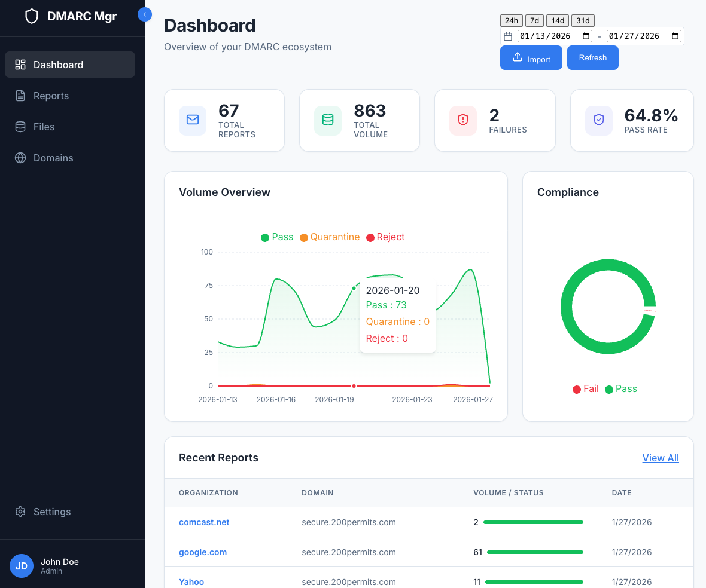

# DMARC Report Manager

**DMARC Report Manager** is a comprehensive toolset for parsing, analyzing, and visualizing DMARC (Domain-based Message Authentication, Reporting, and Conformance) reports. It transforms raw XML/ZIP/GZIP reports into actionable insights, helping you secure your email domain against spoofing.

## Features

- **Multi-Format Parsing**: Supports all common report formats: XML and ZIP report files, and compressed files or archives containing them in GZIP, ZIP, and XZ compression formats.
- **Interactive Dashboard**: Visualize DMARC volume, pass/fail rates, and historical trends.
- **Detailed Analysis**: Drill down into individual reports to see source IPs, DKIM/SPF results, and failure reasons.
- **Troubleshooting Tool**: built-in DNS checker to validate your SPF, DKIM, and DMARC records and suggest fixes.
- **CLI & Web Interface**: Use the command line for automation or the Web GUI for visualization.
- **API backend**: A complete API which all operations in the CLI and Web Interface are done through, with full API authentication and authorization security.
- **Privacy First**: Self-hosted and local-first. No data leaves your machine.

## Tech Stack

- **Backend**: Python 3.12+ (FastAPI, SQLite, dnspython)
- **Frontend**: React (Vite, Recharts, Lucide, Tailwind-free CSS)
- **Package Management**: `uv` (Python) and `pnpm` (Node.js)

## Screenshot


## API Documentation
The backend provides a RESTful API for integration and automation. See [API.md](API.md) for details and usage examples.

## Getting Started

### Prerequisites

- Python 3.12+
- Node.js 18+
- `uv` (Python package manager)
- `pnpm` (Node package manager)

### Installation

1.  **Clone the repository**:
    ```bash
    git clone https://github.com/jonzobrist/DMARC-Report-Manager.git
    cd DMARC-Report-Manager
    ```

2.  **Setup the Backend**:
    ```bash
    # Install dependencies and create virtualenv
    uv sync
    ```

3.  **Setup the Frontend**:
    ```bash
    cd frontend
    pnpm install
    ```

## Usage

#### Configuration
The application can be configured using environment variables or a `.env` file in the project root. See `.env.example` for all available options.

Key settings:
- `BACKEND_PORT`: Port for the API backend (default: 8000).
- `FRONTEND_PORT`: Port for the React frontend (default: 5173).
- `ALLOWED_HOSTS`: Hosts allowed by the backend (e.g., `localhost,dmarc.example.com`). **Note**: Include your frontend domain here so it is automatically trusted for CORS.
- `CORS_ALLOWED_ORIGINS`: Full URLs allowed for browser CORS (e.g., `https://dmarc.example.com`).
- `VITE_API_URL`: The URL where the browser can reach the backend API (e.g., `https://dmarc-api.example.com`).

> [!IMPORTANT]
> **CORS Troubleshooting**: 
> If you get "CORS blocked" errors:
> 1. Ensure `ALLOWED_HOSTS` contains the **frontend's** domain (where you are typing the address in the browser).
> 2. Ensure `VITE_API_URL` is the correct **backend** URL.
> 3. If using Nginx, ensure it is **not** also adding CORS headers (like `add_header Access-Control-Allow-Origin`), as having two headers will cause the browser to block the request.

#### Running the Web Application
A convenience script is provided to start both services using the configured ports:
```bash
./bin/start
```

Alternatively, you can start them manually:

1.  **Start the Backend API**:
    ```bash
    uv run uvicorn backend.web.api:app --host 127.0.0.1 --port 8000
    ```

2.  **Start the Frontend Dev Server**:
    ```bash
    cd frontend
    pnpm dev
    ```
    Open your browser to `http://localhost:5173`.

#### Service Management (Linux/systemd)
Use the management script to install the background services:
```bash
sudo ./bin/manage-service install
./bin/manage-service status
```

### Using the CLI

The project includes a CLI for managing reports directly from the terminal.

```bash
# Get help
uv run python -m backend.cli.main --help

# Troubleshoot a domain
uv run python -m backend.cli.main troubleshoot example.com

# Import reports
uv run python -m backend.cli.main import ./path/to/reports/

# Reset admin password (utility script)
./bin/reset-admin-password [new_password]
```


#### Remote CLI Usage
The CLI tools can be used to manage a remote instance by specifying the API URL:
```bash
# Using environment variable
export DMARC_API_URL="http://dmarc.example.com"
./bin/list-reports

# Using command-line argument
./bin/list-reports --api-url "http://dmarc.example.com"
```

### Contributing

1.  Fork the Project
2.  Create your Feature Branch (`git checkout -b feature/AmazingFeature`)
3.  Commit your Changes (`git commit -m 'Add some AmazingFeature'`)
4.  Push to the Branch (`git push origin feature/AmazingFeature`)
5.  Open a Pull Request

> [!IMPORTANT]
> **Documentation Rule**: When adding new utilities, scripts, or significant features, you **must** update the corresponding documentation in [README.md](README.md), [DEVELOPMENT_STATE.md](DEVELOPMENT_STATE.md), and [API.md](API.md) (if applicable).
> **Task Tracking Rule**: When completing a task, you **must** update [TODO.md](TODO.md) so the task list stays current.


## License

Distributed under the MIT License. See `LICENSE` for more information.

## Current Features

- Multi-Format Parsing
- Interactive Dashboard
- Detailed Analysis
- Troubleshooting Tool
- CLI & Web Interface
- API backend
- Privacy First

## TODO / Roadmap

See [TODO.md](TODO.md) for a detailed list of pending work and completed features.
